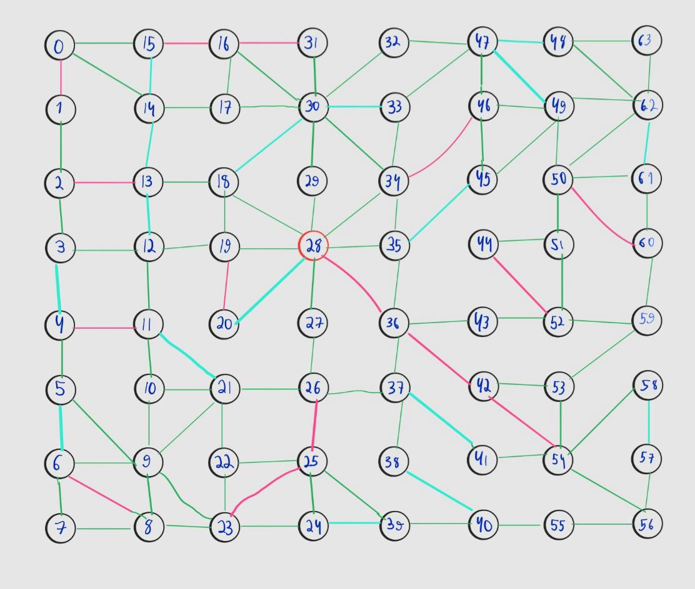

# Projeto: Expansão de Rede Elétrica para Distribuição de Internet

Este projeto tem como objetivo modelar e simular, utilizando a teoria dos grafos, a expansão de uma rede elétrica para distribuição de internet. A aplicação busca identificar, a partir de um poste que ainda não está conectado (representando um novo cliente), o menor caminho até um poste já conectado à rede da provedora, levando em consideração as restrições de capacidade dos postes e a distância entre eles.

---
## Exemplo de Entrada e Representação do Grafo

Junto ao código fonte, encontra-se o arquivo `entrada.txt`, que contém a descrição do grafo utilizado no projeto. Esse arquivo define os postes e as conexões entre eles, com os respectivos pesos (distâncias). A estrutura definida neste arquivo foi utilizada para construir a rede elétrica simulada.

A seguir, uma imagem representativa do grafo gerado a partir dos dados contidos no `entrada.txt`:



> *Nota: A imagem acima ilustra a estrutura do grafo montado a partir do arquivo `entrada.txt`, onde cada vértice representa um poste e cada aresta representa uma conexão entre os postes com o seu peso correspondente. O Poste ID 28 representa a provedora. As arestas azuis possuem 7m. As arestas verdes possuem 8m. As arestas rosas possuem  9m
*

---
## Visão Geral

O projeto simula a expansão de uma rede elétrica para distribuição de internet. Cada poste da rede é modelado como um vértice em um grafo não direcionado e ponderado, onde as arestas representam as conexões entre os postes com pesos que indicam a distância entre eles. Além disso, cada poste possui uma capacidade máxima para atender um número limitado de residências, garantindo que a rede não seja sobrecarregada.

O algoritmo principal utilizado para identificar o caminho mais curto até um poste conectado com capacidade disponível é uma adaptação do algoritmo de **Busca em Largura (BFS)**, que, mesmo aplicado em um grafo ponderado, se mostra eficiente devido à uniformidade das distâncias entre os postes.

---

## Funcionalidades

- **Modelagem de Postes:** Cada poste possui um identificador único, estado de conexão e um limite máximo de atendimento.
- **Representação de Conexões:** Conexões entre postes com pesos que indicam a distância entre eles.
- **Construção da Rede:** Estrutura da rede representada por uma lista de adjacência para acesso rápido aos vizinhos.
- **Busca do Melhor Caminho:** Utilização do algoritmo de Busca em Largura para encontrar o caminho mais curto até um poste conectado com capacidade disponível.
- **Atualização Dinâmica:** Incremento do número de casas atendidas nos postes à medida que novos clientes são conectados.
- **Leitura de Dados:** Carregamento de dados a partir de um arquivo de texto estruturado.

---

## Tecnologias Utilizadas

- **Java:** Linguagem de programação para a implementação do sistema.
- **Programação Orientada a Objetos (POO):** Estrutura modular com classes específicas para representar os elementos da rede.
- **Leitura de Arquivos:** Utilização de classes para processar arquivos de texto contendo os dados da rede.

---

## Estrutura do Projeto

O projeto é organizado nas seguintes classes:

- **Poste:**  
  Representa cada poste da rede elétrica, com atributos para identificar seu estado de conexão e a capacidade máxima (quantidade máxima de casas atendidas).

- **Conexoes:**  
  Modela as ligações entre os postes, armazenando os postes de origem e destino, bem como a distância (peso) da conexão.

- **RedeEletrica:**  
  Agrega os postes e as conexões, organizando-os em uma estrutura de lista de adjacência, que mapeia os postes aos seus respectivos vizinhos.

- **LeitorArquivo:**  
  Responsável por ler os dados de entrada (número de postes, conexões e distâncias) e construir a rede elétrica com base nesses dados.

- **BuscaEmLargura:**  
  Implementa a lógica de busca adaptada (BFS) para identificar o menor caminho entre um poste não conectado e um poste conectado com capacidade disponível. Essa classe inclui métodos para:
  - Encontrar o caminho (`encontrarCaminho`).
  - Reconstruir o caminho encontrado.
  - Conectar os postes do caminho.
  - Calcular a distância total do caminho.
  - Gerar uma representação em string do caminho.

---

## Como Executar

1. **Pré-requisitos:**
   - JDK 8 ou superior.
   

2. **Clonar o Repositório:**
   ```bash
   git clone <URL_DO_REPOSITÓRIO>
